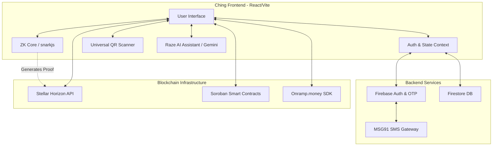
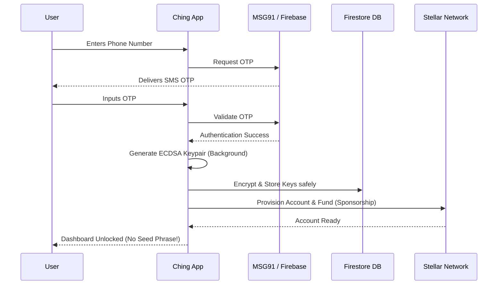
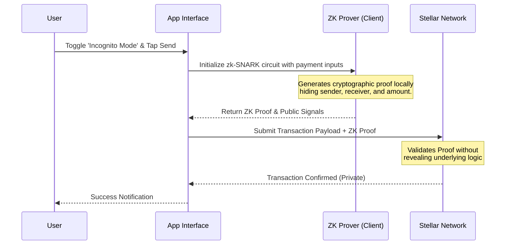

<p align="center">
  
</p>

<h1 align="center">Ching (StellarUPI)</h1>

<p align="center">
  <strong>The "UPI for Crypto" — Bridging Decentralized Finance with the Familiarity of Everyday Payments</strong>
  <br />
  <em>Next-Generation Web3 Payment System built on the Stellar Blockchain</em>
</p>

<p align="center">
  
  
  
  
  
</p>

---

## 🌟 Vision

**Ching (StellarUPI)** is designed to revolutionize the mass adoption of blockchain technology by mapping the complex world of Web3 onto the highly successful, intuitive **UPI (Unified Payments Interface)** model.

We eliminate the friction of 12-word seed phrases, gas fee calculations, and long hexadecimal addresses. Instead, users onboard with just a phone number and transact using human-readable IDs, bringing fractions-of-a-cent fees and sub-five-second finality of the **Stellar Network** to everyday users.

---

## ✨ Core Features

### 🔐 Frictionless Web2-to-Web3 Onboarding
- **Phone Number Login**: No seed phrases. Users authenticate via SMS OTP (MSG91 integration) to instantly provision a non-custodial wallet.
- **Auto-Generated Stellar IDs**: Users automatically receive a human-readable identifier (e.g., `user@stellar`).
- **PAN Verification / KYC**: Secure identity verification bridging the trust gap between fiat and crypto systems.

### 💸 Universal & Private Payments
- **Zero-Knowledge (ZK) Incognito Mode**: Toggle "Incognito Mode" to leverage ZK proofs for payments. Settle instantly on the public Stellar network while keeping financial details strictly private.
- **Universal QR Scanner**: Scan *any* standard payment QR code (EVM or Stellar) to seamlessly pay directly from your native balance via cross-chain interoperability.
- **Direct Fiat Onramp**: Buy XLM natively using INR via an integrated Onramp SDK overlay. No need to visit external exchanges.
- **Scheduled Payments**: Set-and-forget recurring payments powered by programmable logic.

### 👨‍👩‍👧‍👦 Social Finance & Shared Economy
- **Integrated Social Chat**: Chat directly with friends, send money, or trigger a **Payment Request** seamlessly within the messaging interface.
- **Group Payments & Split Bills**: Create groups, divide expenses equally or customize splits, and settle debts instantly in crypto.
- **Family Vaults**: Shared economy features allowing parents to set up master vaults, add dependents, and assign configurable spending limits.

### 🤖 Raze AI Assistant
- **Neural Financial Intelligence**: Powered by **Gemini API**, Raze provides instant insights into your spending habits.
- **Voice-to-Action**: Send money or check balances using natural voice commands.

---

## 🏗️ System Architecture & Data Flows

### 1. High-Level System Architecture



### 2. Frictionless Onboarding Flow (Web2 to Web3)



### 3. ZK "Incognito" Payment Flow



---

## 🛠️ Tech Stack

- **Frontend Core**: React 19, TypeScript 5.8, Vite 6
- **State & Data**: Firebase Auth & Firestore, React Router
- **Cryptography & Privacy**: `snarkjs`, `circomlibjs`, Ethers.js
- **Blockchain**: Stellar SDK (`@stellar/stellar-sdk`), Freighter API (`@stellar/freighter-api`)
- **UI/UX & Animation**: Tailwind CSS, Framer Motion, Lucide React, LottieFiles
- **Integrations**: Onramp (Fiat), MSG91 (SMS OTP), Tesseract.js (OCR), Gemini API (AI)

---

## 🚀 Getting Started

### Prerequisites

- Node.js (v18.x or v20.x)
- Firebase Project Setup
- (Optional) MSG91 API Keys for SMS OTP, Onramp keys for Fiat.

### Installation

```bash
# Clone the repository
git clone https://github.com/Tuhin810/StellarUpi.git
cd StellarUpi

# Install dependencies
npm install

# Setup environment variables
cp .env.example .env
# Fill in your Firebase, Stellar, and Onramp keys
```

### Development

```bash
# Start the local development server
npm run dev
```

---

## ⚖️ Legal, Security & Compliance

- **FIDO2 / WebAuthn**: Supports hardware-standard biometric transaction signing.
- **KYC & PAN Integration**: Designed to be compliant for regional Virtual Digital Asset Service Provider (VDASP) operations.
- **Non-Custodial**: Private keys are encrypted locally and never exposed to the server in plaintext.

---

<p align="center">
  <strong>Built with ❤️ for the Stellar Community Fund</strong>
  <br />
  <em>Empowering the next billion users with Decentralized Finance.</em>
</p>
