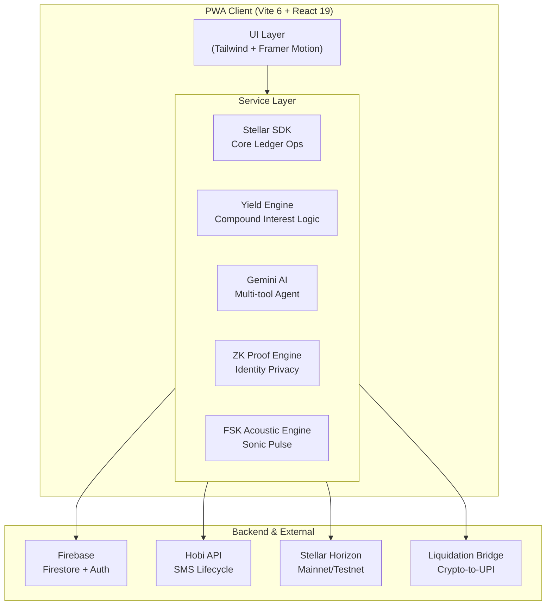

<p align="center">
  
</p>

<h1 align="center">Ching — The StellarUPI Ecosystem</h1>

<p align="center">
  <strong>"The UPI for Crypto" — Redefining Universal Payments on the Stellar Blockchain</strong>
  <br />
  <em>A Premium, High-Performance Web3 Financial Suite for Everyday Transactions</em>
</p>

<p align="center">
  
  
  
  
  
  
</p>

---

## 💎 The Flagship Innovations

Ching isn't just a wallet; it's a **next-generation financial operating system** built on Stellar. It bridges the gap between decentralized finance and the familiarity of Web2 payment systems like UPI.

### 1. Direct UPI Liquidation Bridge ⚡
The ultimate off-ramp experience. Scan **any standard UPI QR code** (at a grocery store, cafe, or online merchant), and Ching automatically converts your XLM to INR and executes a direct IMPS/UPI payout via our sandbox bridge. 
- **Zero friction**: Pay merchants in INR using your crypto balance.
- **Speed**: Settle in under 2 seconds.
- **Verification**: Instant "Liquidation Bridge Verified" receipts with RRN (Reference Numbers).

### 2. Gullak 2.0: Streak-Based Yield Engine 🌿
A revolutionary micro-savings vault inspired by the traditional Indian "Gullak" (piggy bank).
- **Chillar Round-Ups**: Automatically rounds up your ₹142 coffee to ₹150, sending the ₹8 "Chillar" to your vault.
- **Tiered APR**: Your interest rate grows as you save consistently.
  - 🟠 **Starter (0-4 Days)**: 3.6% APR
  - 🔵 **Saver (5-14 Days)**: 11% APR
  - 🟣 **Pro Saver (15+ Days)**: 18% APR
- **Protocol Yield**: Daily growth applied directly to your vault balance.

### 3. Raze AI Assistant: Voice-to-Chain Intelligence 🤖
Powered by **Google Gemini 1.5 Flash**, Raze is your personal financial agent.
- **Contextual Actions**: Say "Send 50 XLM to Alice" or "How much do I owe the dinner group?" and Raze executes the tools.
- **AI Receipt Scanner**: Upload any physical bill; Raze itemizes it and populates your Split Expense drawer.
- **Insights**: Proactive spending analysis and budget alerts.

### 4. Sonic Pulse: Acoustic Identity Discovery 🔊
Exchange Stellar IDs with nearby devices using **ultrasonic frequency-shift keying (FSK)**.
- **No Internet Required** for peer discovery.
- **Secure**: High-frequency encoded audio (16kHz+) that replaces QR scanning for 1-on-1 transfers.
- **Instant**: Transmits `username@stellar` through air in seconds.

### 5. ZK-Identity & Incognito Mode 🛡️
Toggle **Incognito Mode** for complete payment privacy.
- **Groth16 ZK-SNARKs**: Generates simulated zero-knowledge proofs for identity and amount.
- **Private Settlements**: Transactions settle on Stellar but remain shielded from the public activity feed.
- **Protocol 25 Verification**: Uses cutting-edge hashing for identity commitments.

---

## 📑 Detailed Feature Matrix

### Frictionless Onboarding
| Feature | Implementation |
|---------|----------------|
| **Seedless Login** | SMS OTP authentication (via Hobi API) — phone number becomes your key. |
| **Passkey Security** | WebAuthn (FaceID/TouchID) for transaction signing and vault access. |
| **PAN Compliance** | Tesseract.js WASM-based OCR scans physical PAN cards for instant KYC. |
| **Self-Custody** | Keys encrypted with `SHA-256(phone + PIN)` — never leaves the browser. |

### Universal Payments
| Feature | Implementation |
|---------|----------------|
| **Universal QR** | Multi-hop scanner for Stellar, SEP-7, UPI, and Ethereum URIs. |
| **Viral Payment Links** | Send money to **anyone** via a WhatsApp link — recipient claims via Stellar Claimable Balance. |
| **Freighter Integration** | Native Freighter extension and WalletConnect v2 support. |
| **Fiat Gateways** | Deep integration with Onramp.money (In) and Transak (Out). |

### Social Finance
| Feature | Implementation |
|---------|----------------|
| **P2P Chat** | Firebase-powered real-time messaging interleaved with transaction history. |
| **Family Vaults** | Delegated spending: set daily limits for family members in a shared vault. |
| **Group Expense Split** | Persistent groups with equal or custom split settlement logic. |
| **Scheduled AutoPay** | Recurring background workers for bills and subscriptions. |

---

## 🏗️ Technical Architecture

Ching follows a **modular service-oriented architecture** focused on security and performance.



---

## 📂 Project Structure

```
StellarUpi/
├── services/                      # Business Logic
│   ├── liquidationService.ts      #   Direct UPI Bridge Settlement
│   ├── zkProofService.ts          #   ZK-SNARK Proof Generation
│   ├── aiService.ts               #   Gemini Function Calling Logic
│   ├── stellar.ts                 #   Stellar SDK Implementation
│   └── db.ts                      #   Gullak Yield & Firestore Engine
├── pages/                         # Route Components (24 total)
│   ├── Gullak.tsx                 #   Savings Dashboard (Tiered Yield)
│   ├── SendMoney.tsx              #   Universal Payment Flow
│   └── SonicHandshake.tsx         #   Acoustic Transfer Interface
├── components/                    # Atomic UI Units
│   └── SuccessScreen.tsx          #   Verified Receipt Generator
└── public/                        # PWA Assets
    └── manifest.json              #   App Store Manifest
```

---

## 🚀 Getting Started

1. **Clone & Install**:
   ```bash
   npm install
   ```
2. **Setup Environment**:
   Create a `.env` with your Firebase, Gemini, and Hobi API keys.
3. **Run Dev**:
   ```bash
   npm run dev
   ```
4. **PWA Installation**:
   Open in Chrome/Safari and tap "Add to Home Screen" for the full app experience.

---

## 📈 Roadmap (Next Phases)

- [ ] **Cross-Chain Expansion**: Bridging Ethereum/Polygon assets to Stellar for universal UPI.
- [ ] **Merchant SDK**: One-click checkout for e-commerce sites.
- [ ] **Offline Payments**: True offline transaction signing via Sonic Pulse + delayed submission.
- [ ] **Native Mobile Releases**: Publishing PWA as TWA on Google Play and using Capacitor for Apple App Store.

---

<p align="center">
  Built with ❤️ for the <strong>Stellar Community Fund</strong>
</p>
