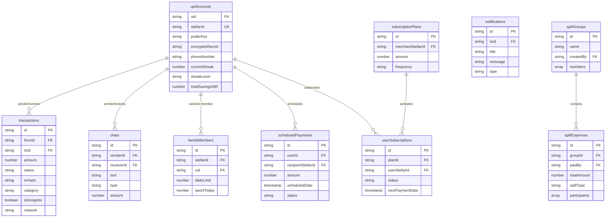

<p align="center">
  
</p>

<h1 align="center">Ching — StellarUPI</h1>

<p align="center">
  <strong>The "UPI for Crypto" — Bridging Decentralized Finance with the Familiarity of Everyday Payments</strong>
  <br />
  <em>Next-Generation Web3 Payment System built on the Stellar Blockchain</em>
</p>

<p align="center">
  
  
  
  
  
  
  
</p>

---

## Table of Contents

- [Vision](#vision)
- [Core Features](#core-features)
- [Architecture Overview](#architecture-overview)
- [System Architecture Diagram](#system-architecture-diagram)
- [User Flow Diagrams](#user-flow-diagrams)
  - [Onboarding & Authentication Flow](#onboarding--authentication-flow)
  - [Payment (Send Money) Flow](#payment-send-money-flow)
  - [Chillar Round-Up Savings Flow](#chillar-round-up-savings-flow)
  - [ZK Incognito Payment Flow](#zk-incognito-payment-flow)
  - [Viral Claimable Balance Flow](#viral-claimable-balance-flow)
  - [Family Vault Delegation Flow](#family-vault-delegation-flow)
  - [Group Split Expense Flow](#group-split-expense-flow)
  - [Scheduled Payment Worker Flow](#scheduled-payment-worker-flow)
  - [Sonic Pulse (Acoustic Transfer) Flow](#sonic-pulse-acoustic-transfer-flow)
  - [Raze AI Assistant Flow](#raze-ai-assistant-flow)
  - [Fiat On-Ramp / Off-Ramp Flow](#fiat-on-ramp--off-ramp-flow)
  - [WalletConnect / Freighter Flow](#walletconnect--freighter-flow)
- [Project Structure](#project-structure)
- [Pages Reference](#pages-reference)
- [Services Reference](#services-reference)
- [Components Reference](#components-reference)
- [Data Models](#data-models)
- [Tech Stack](#tech-stack)
- [Environment Variables](#environment-variables)
- [Getting Started](#getting-started)
- [Deployment](#deployment)
- [Security Model](#security-model)
- [Gullak Yield Engine](#gullak-yield-engine)
- [Firestore Collections](#firestore-collections)
- [API Endpoints & External Services](#api-endpoints--external-services)
- [Browser Compatibility](#browser-compatibility)
- [License](#license)

---

## Vision

**Ching (StellarUPI)** is designed to revolutionize the mass adoption of blockchain technology by mapping the complex world of Web3 onto the highly successful, intuitive **UPI (Unified Payments Interface)** model.

We eliminate the friction of 12-word seed phrases, gas fee calculations, and long hexadecimal addresses. Instead, users onboard with just a phone number and transact using human-readable IDs (e.g., `987654@stellar`), bringing fractions-of-a-cent fees and sub-five-second finality of the **Stellar Network** to everyday users.

---

## Core Features

### Frictionless Web2-to-Web3 Onboarding
| Feature | Description |
|---------|-------------|
| **Phone Number Login** | SMS OTP authentication (via Hobi SMS API) — no seed phrases, no MetaMask popups |
| **Auto-Generated Stellar Handles** | Human-readable `username@stellar` identifiers replace 56-character public keys |
| **Embedded KYC (PAN Verification)** | In-browser OCR scan of Indian PAN cards via Tesseract.js WASM — image never leaves device |
| **Biometric Auth (WebAuthn/Passkeys)** | FaceID / TouchID / Windows Hello for transaction signing via platform authenticators |
| **Client-Side Key Encryption** | Stellar secret encrypted with `SHA256(phone + PIN)` — server never sees plaintext keys |

### Universal & Private Payments
| Feature | Description |
|---------|-------------|
| **Zero-Knowledge "Incognito Mode"** | Toggle ZK proofs on demand — generates Groth16-style proof hiding sender, receiver, and amount |
| **Universal QR Scanner** | Scans Stellar addresses, SEP-7 URIs, UPI QR codes, Ethereum EIP-681 URIs — auto-routes cross-chain |
| **Freighter & WalletConnect** | Connect Freighter browser extension or any WalletConnect-compatible Stellar wallet |
| **Fiat On-Ramp (Buy XLM)** | Buy XLM with INR via integrated Onramp.money SDK overlay — never leave the app |
| **Bank Withdrawal (Off-Ramp)** | Sell XLM to INR directly to bank account via Transak SDK |
| **Path Payments** | Built-in Stellar path-finding swaps assets (e.g., USDC to XLM) for best exchange rate |
| **Viral Payment Links** | Send XLM to anyone via shareable link — recipient claims even without an existing wallet |
| **Scheduled Payments** | Set-and-forget future payments with background worker execution |

### Social Finance & Shared Economy
| Feature | Description |
|---------|-------------|
| **Real-time P2P Chat** | Firebase-powered instant messaging interleaved with transaction history |
| **In-Chat Payment Requests** | Drop "Request Money" cards in conversations — one-tap on-chain settlement |
| **Group Ledgers & Split Bills** | Create groups for shared expenses — equal or custom splits with settlement tracking |
| **Gullak (Savings Vault)** | Piggy-bank micro-savings vault with streak-based yield (3.6%–18% APR) |
| **Family Vaults** | Delegated spending — parent creates vault, adds members with granular daily limits |
| **Chillar Round-Ups** | Automatic spare-change savings: ₹142 transaction sends ₹8 auto-deposited to Gullak vault |

### Raze AI Assistant
| Feature | Description |
|---------|-------------|
| **Neural Financial Intelligence** | Google Gemini 1.5 Flash with function-calling for proactive spending insights |
| **Voice-to-Action** | Natural language commands: "Send 50 XLM to Alice" — AI resolves names and executes |
| **AI Receipt Scanner (OCR)** | Tesseract.js scans physical receipts, itemizes purchases, auto-splits among group members |

### Sonic Pulse (Acoustic Transfer)
| Feature | Description |
|---------|-------------|
| **Ultrasonic Identity Exchange** | Transfer Stellar IDs between nearby devices via FSK-encoded sound waves (16kHz+) |
| **No Internet Required** | Works offline for peer discovery — payment completes when connectivity resumes |

---

## Architecture Overview

Ching follows a **client-heavy, non-custodial architecture** where critical operations (key generation, encryption, transaction signing, ZK proof generation) happen entirely on the user's device.

```
┌─────────────────────────────────────────────────────────────────┐
│                         CLIENT (PWA)                            │
│  ┌──────────┐  ┌───────────┐  ┌──────────┐  ┌───────────────┐  │
│  │ React 19 │  │ Stellar   │  │ ZK Proof  │  │ Web Audio API │  │
│  │ + Vite 6 │  │ SDK       │  │ Engine    │  │ (Sonic Pulse) │  │
│  └──────────┘  └───────────┘  └──────────┘  └───────────────┘  │
│  ┌──────────┐  ┌───────────┐  ┌──────────┐  ┌───────────────┐  │
│  │ CryptoJS │  │ WebAuthn  │  │ Tesseract │  │ Gemini AI     │  │
│  │ (AES)    │  │ Passkeys  │  │ WASM OCR  │  │ (Function     │  │
│  └──────────┘  └───────────┘  └──────────┘  │  Calling)      │  │
│                                              └───────────────┘  │
└───────────────────────┬─────────────────────────────────────────┘
                        │
          ┌─────────────┼─────────────────┐
          ▼             ▼                 ▼
┌──────────────┐ ┌─────────────┐ ┌──────────────────┐
│ Stellar      │ │ Firebase    │ │ External APIs    │
│ Horizon API  │ │ (Firestore  │ │ ┌──────────────┐ │
│ (Testnet /   │ │  + Auth)    │ │ │ CoinGecko    │ │
│  Mainnet)    │ │             │ │ │ Onramp.money │ │
└──────────────┘ └─────────────┘ │ │ Transak      │ │
                                  │ │ Hobi SMS     │ │
                                  │ │ DiceBear     │ │
                                  │ │ LinkMyDeals  │ │
                                  └─┴──────────────┴─┘
```

---

## System Architecture Diagram


---

## User Flow Diagrams

### Onboarding & Authentication Flow


### Payment (Send Money) Flow


### Chillar Round-Up Savings Flow


### ZK Incognito Payment Flow


### Viral Claimable Balance Flow


### Family Vault Delegation Flow


### Group Split Expense Flow


### Scheduled Payment Worker Flow


### Sonic Pulse (Acoustic Transfer) Flow


### Raze AI Assistant Flow


### Fiat On-Ramp / Off-Ramp Flow


### WalletConnect / Freighter Flow


---

## Project Structure

```
StellarUpi/
├── App.tsx                        # Root component — providers, routing, background workers
├── index.tsx                      # React DOM entry point
├── index.html                     # HTML shell
├── index.css                      # Global styles (Tailwind directives)
├── types.ts                       # Global TypeScript interfaces (13 types)
├── vite.config.ts                 # Vite 6 config — env injection, aliases
├── tsconfig.json                  # TypeScript config
├── package.json                   # Dependencies & scripts
├── firebase.json                  # Firebase hosting/functions config
├── firestore.indexes.json         # Composite Firestore indexes
│
├── context/                       # React Context Providers
│   ├── AuthContext.tsx             #   Firebase Auth + real-time profile sync
│   ├── NetworkContext.tsx          #   Stellar testnet/mainnet toggle
│   └── NotificationContext.tsx     #   Toast notification queue
│
├── services/                      # Business Logic Layer
│   ├── stellar.ts                 #   Core Stellar SDK operations
│   ├── db.ts                      #   Firestore CRUD, yield engine, streaks
│   ├── zkProofService.ts          #   ZK-SNARK proof generation (Groth16)
│   ├── aiService.ts               #   Gemini AI with function calling
│   ├── encryption.ts              #   AES encrypt/decrypt (CryptoJS)
│   ├── firebase.ts                #   Firebase app initialization
│   ├── kycService.ts              #   PAN verification + key derivation
│   ├── passkeyService.ts          #   WebAuthn biometric registration
│   ├── walletConnectService.ts    #   WalletConnect v2 Stellar integration
│   ├── notification.ts            #   Real-time Firestore notification listeners
│   ├── priceService.ts            #   CoinGecko XLM/INR price feed
│   ├── scheduledPayService.ts     #   Background payment execution worker
│   ├── onramp.ts                  #   Onramp.money fiat-to-crypto SDK
│   ├── transak.ts                 #   Transak off-ramp SDK
│   ├── claimableBalanceService.ts #   Viral payment link creation/claiming
│   ├── verificationService.ts     #   OTP verification (Hobi SMS)
│   ├── panScannerService.ts       #   Tesseract.js PAN card OCR
│   ├── couponApi.ts               #   Rewards/coupon feed aggregator
│   ├── avatars.ts                 #   DiceBear avatar URL generator
│   └── web3.ts                    #   Stellar ID generation from phone
│
├── pages/                         # Route-Level Page Components (24 pages)
│   ├── Login.tsx                  #   Multi-step onboarding (phone → OTP → KYC → wallet)
│   ├── Dashboard.tsx              #   Home — balance, contacts, quick actions
│   ├── SendMoney.tsx              #   Full payment flow (1400+ lines)
│   ├── ReceiveMoney.tsx           #   QR display, WalletConnect receive, Sonic Pulse
│   ├── ChatPage.tsx               #   Real-time P2P chat + transaction timeline
│   ├── QRScanner.tsx              #   Camera scanner (Stellar/SEP-7/UPI/ETH)
│   ├── Gullak.tsx                 #   Micro-savings vault dashboard
│   ├── StreakPage.tsx             #   Savings streak calendar visualization
│   ├── Transactions.tsx           #   Transaction history with filters + CSV export
│   ├── TransactionDetail.tsx      #   Single transaction receipt + explorer link
│   ├── AddMoney.tsx               #   Fiat on-ramp (buy XLM)
│   ├── Withdraw.tsx               #   Fiat off-ramp (sell XLM to bank)
│   ├── Profile.tsx                #   User profile management
│   ├── FamilyManager.tsx          #   Family vault owner dashboard
│   ├── SharedWallet.tsx           #   Family member spending interface
│   ├── GroupPage.tsx              #   Group chat + split expenses
│   ├── AutoPay.tsx                #   Active subscription management
│   ├── Subscribe.tsx              #   Subscription confirmation page
│   ├── PaymentLink.tsx            #   Public payment gateway (3 methods)
│   ├── ClaimFunds.tsx             #   Viral payment link claiming
│   ├── SonicHandshake.tsx         #   Sonic Pulse wrapper page
│   ├── SchedulePay.tsx            #   Future payment scheduling
│   ├── Security.tsx               #   PIN, passkey, notification settings
│   └── Rewards.tsx                #   Coupon/deals hub
│
├── components/                    # Reusable UI Components
│   ├── AIAssistant.tsx            #   Full-screen Raze AI chat interface
│   ├── BalanceCard.tsx            #   Credit-card-style wallet balance widget
│   ├── BottomNav.tsx              #   Bottom navigation bar
│   ├── ContactSelector.tsx        #   Contact search + selection list
│   ├── CreateGroupModal.tsx       #   Group creation modal
│   ├── DashboardHeader.tsx        #   Dashboard top bar (avatar, name, streak)
│   ├── Loader.tsx                 #   Loading spinner (DotLottie)
│   ├── PeopleList.tsx             #   Recent contacts + groups list
│   ├── ProtectedRoute.tsx         #   Auth route guard
│   ├── PWAInstallPrompt.tsx       #   PWA install banner
│   ├── QuickActions.tsx           #   Dashboard action buttons grid
│   ├── ReceiveQRModal.tsx         #   QR code display modal
│   ├── RewardsCTA.tsx             #   Rewards promotional banner
│   ├── SecurityPrompt.tsx         #   PIN/biometric setup nudge modal
│   ├── SideDrawer.tsx             #   Navigation side drawer
│   ├── SonicTransfer.jsx          #   Sonic Pulse send/receive UI
│   ├── StreakFire.tsx             #   Animated streak flame badge
│   ├── SuccessScreen.tsx          #   Payment success confirmation
│   ├── UniversalQR.tsx            #   QR code generator with avatar overlay
│   ├── UpiDrawer.tsx              #   UPI/Stellar ID input drawer
│   └── Group/                     #   Group-specific sub-components
│       ├── ActivityItem.tsx       #     Chat message / split card renderer
│       ├── ManageMembersDrawer.tsx #    Add/remove group members
│       └── SplitExpenseDrawer.tsx  #    Create equal/custom expense splits
│
├── hooks/                         
│   └── useSonic.js                #   Microphone access hook for Sonic Pulse
│
├── utils/                         
│   ├── chillar.ts                 #   Round-up savings calculator
│   └── StellarPulse.js            #   FSK acoustic encoding/decoding engine
│
├── assets/                        # Static assets (images, sounds, Lottie)
├── docs/                          # Documentation
│   ├── prd.md                     #   Product Requirements Document
│   ├── context.md                 #   Codebase context overview
│   ├── features_and_conversion.md #   Feature specs & conversion metrics
│   ├── getting-started.md         #   Setup guide
│   ├── payments-and-assets.md     #   Payment architecture details
│   ├── offramp_implementation.md  #   Off-ramp integration guide
│   ├── sonic_pulse.md             #   Sonic Pulse protocol spec
│   └── GITBOOK_GUIDE.md           #   GitBook publishing guide
│
├── functions/                     # Firebase Cloud Functions
│   ├── index.js                   #   Serverless API (AutoPay execution, etc.)
│   └── package.json               #   Functions dependencies
│
├── netlify/                       # Netlify serverless functions
│   └── functions/notify.js        #   Push notification endpoint
│
├── public/                        # Static public files
│   ├── manifest.json              #   PWA manifest
│   ├── sw.js                      #   Service worker
│   ├── ggwave.js                  #   ggwave audio library
│   └── _redirects                 #   Netlify SPA redirect rules
│
└── routes/
    └── AppRoutes.tsx              # All route definitions (24 routes)
```

---

## Pages Reference

| Page | Route | Auth | Description | Stellar Ops |
|------|-------|------|-------------|-------------|
| **Login** | `/login` | Public | Multi-step onboarding: phone → OTP → PAN KYC → wallet creation | `createWallet`, `encryptSecret` |
| **Dashboard** | `/` | Protected | Home screen — balance card, recent contacts, quick actions, security prompt | Balance (indirect) |
| **SendMoney** | `/send` | Protected | Full payment flow: contact selection, amount, PIN, payment. Supports Chillar, incognito, WalletConnect, viral links | `sendPayment`, `sendChillarPayment`, ZK proofs |
| **ReceiveMoney** | `/receive` | Protected | QR code display, payment link generator, Sonic Pulse, WalletConnect receive | WalletConnect receive |
| **ChatPage** | `/chat/:contactId` | Protected | Real-time 1:1 chat interleaved with transaction history + inline payment requests | — |
| **QRScanner** | `/scan` | Protected | Camera QR scanner: Stellar, SEP-7, UPI, Ethereum URI parsing | Parse Stellar/SEP-7 |
| **Transactions** | `/transactions` | Protected | Full transaction history with category filters, search, CSV export | — |
| **TransactionDetail** | `/transaction/:txId` | Protected | Single transaction receipt with blockchain explorer link | Explorer link |
| **AddMoney** | `/add-money` | Protected | Fiat on-ramp — buy XLM with INR via Onramp.money | `getBalance` |
| **Withdraw** | `/withdraw` | Protected | Fiat off-ramp — sell XLM to bank via Transak | `getBalance` |
| **Gullak** | `/gullak` | Protected | Micro-savings vault — balance, yield, streak tiers, savings history | `getBalance` (Gullak vault) |
| **StreakPage** | `/streak` | Protected | Visual savings streak calendar with monthly navigation | — |
| **Profile** | `/profile` | Protected | Avatar upload (Cloudinary), display name, spending limit, phone management | — |
| **FamilyManager** | `/family` | Protected | Owner dashboard — add/remove family members, set daily limits | Decrypt/re-encrypt secrets |
| **SharedWallet** | `/shared` | Protected | Family member spending interface — spend from owner's wallet within limits | `sendPayment` |
| **GroupPage** | `/group/:groupId` | Protected | Group chat + split expense timeline with real-time Firestore sync | — |
| **AutoPay** | `/autopay` | Protected | Active recurring subscriptions list with cancel option | — |
| **Subscribe** | `/subscribe/:planId` | Public | Subscription plan confirmation and activation | — |
| **PaymentLink** | `/pay/:stellarId` | Public | Universal payment gateway — Freighter / Native / MetaMask | TX build/sign/submit |
| **ClaimFunds** | `/claim` | Public | Viral payment link claiming — redeem claimable balances | `claimClaimableBalance` |
| **SonicHandshake** | `/sonic` | Protected | Sonic Pulse acoustic identity transfer page | — |
| **SchedulePay** | `/schedule-pay` | Protected | Schedule future one-time payments with date/time picker | — |
| **Security** | `/security` | Protected | PIN management, passkey registration, notification settings | Vault re-keying |
| **Rewards** | `/rewards` | Protected | Live coupon/deal aggregation hub | — |

---

## Services Reference

| Service | File | Purpose | External Dependencies |
|---------|------|---------|----------------------|
| **StellarService** | `stellar.ts` | Wallet creation, balance queries, P2P payments, atomic Chillar payments | Stellar Horizon API |
| **DatabaseService** | `db.ts` | All Firestore operations — users, transactions, groups, splits, subscriptions, streaks, yield engine | Firebase Firestore |
| **ZKProofService** | `zkProofService.ts` | Groth16-style ZK proof generation for incognito payments | `crypto-js`, `stellar-sdk` |
| **AIService** | `aiService.ts` | Gemini 1.5 Flash integration with 5 function tools for financial queries | Google Generative AI |
| **EncryptionService** | `encryption.ts` | AES encrypt/decrypt Stellar secrets, SHA256 password hashing | `crypto-js` |
| **KYCService** | `kycService.ts` | PAN card verification, Poseidon hash identity commitment, encryption key derivation | `crypto-js`, `stellar-sdk` |
| **PasskeyService** | `passkeyService.ts` | WebAuthn platform authenticator registration and verification | Web Crypto API |
| **WalletConnectService** | `walletConnectService.ts` | WalletConnect v2 pairing, session management, XDR signing requests | WalletConnect Relay |
| **NotificationService** | `notification.ts` | Real-time Firestore `onSnapshot` listeners for payments, splits, chats | Firebase Firestore |
| **PriceService** | `priceService.ts` | Live XLM/INR price feed with 2% buffer calculation | CoinGecko API |
| **ScheduledPayService** | `scheduledPayService.ts` | Background worker polling every 30s for due payments — atomic lock + execute | Internal services |
| **OnrampService** | `onramp.ts` | Fiat-to-crypto buy widget via Onramp.money SDK | Onramp.money |
| **TransakService** | `transak.ts` | Crypto-to-fiat sell widget via Transak SDK (staging/prod auto-switch) | Transak |
| **ClaimableBalanceService** | `claimableBalanceService.ts` | Create/claim Stellar claimable balances for viral payment links | Stellar Horizon |
| **VerificationService** | `verificationService.ts` | Phone OTP send/verify via Hobi SMS API | Hobi SMS API |
| **PANScannerService** | `panScannerService.ts` | In-browser PAN card OCR via Tesseract.js WASM — image never leaves device | Tesseract.js |
| **CouponAPI** | `couponApi.ts` | 3-tier coupon feed: LinkMyDeals → DesiDime RSS → static fallbacks | LinkMyDeals, rss2json |
| **AvatarService** | `avatars.ts` | DiceBear avatar URL generation (Dylan style for users, Shapes for groups) | DiceBear API |
| **Web3Service** | `web3.ts` | Stellar ID generation from phone numbers | — |

---

## Components Reference

| Component | Purpose |
|-----------|---------|
| **AIAssistant** | Full-screen Raze AI chat with voice input (MediaRecorder → Gemini transcription) |
| **BalanceCard** | Credit-card-styled widget showing spendable INR, total XLM, reserves, network indicator |
| **BottomNav** | Persistent bottom tab bar — Home, Scan, Transactions, Profile |
| **ContactSelector** | Searchable contact list with avatars, "New Pay" for external IDs |
| **CreateGroupModal** | Modal form for creating split groups with member search |
| **DashboardHeader** | Top bar with avatar, greeting, streak fire badge, sidebar toggle |
| **Loader** | DotLottie animated loading spinner |
| **PeopleList** | Horizontal scrollable list of recent contacts and groups with avatar stacks |
| **ProtectedRoute** | Route guard — redirects to `/login` if unauthenticated, supports `<Outlet>` |
| **PWAInstallPrompt** | Smart install banner for adding Ching to home screen |
| **QuickActions** | 2x3 grid of action buttons (Send, Receive, Scan, Add Money, etc.) |
| **ReceiveQRModal** | Modal displaying user's payment QR code |
| **RewardsCTA** | Promotional banner linking to rewards/coupon hub |
| **SecurityPrompt** | Nudge modal for PIN or biometric setup (3s delay, sessionStorage-gated) |
| **SideDrawer** | Full-height navigation drawer with all app links + logout |
| **SonicTransfer** | Acoustic transfer UI — encode/transmit (send) or FFT decode (receive) Stellar IDs |
| **StreakFire** | Animated flame icon with tier color (orange/blue/purple) and streak count |
| **SuccessScreen** | Payment confirmation with Lottie animation, ZK proof modal, share receipt |
| **UniversalQR** | QR code generator with embedded avatar overlay using external API |
| **UpiDrawer** | Bottom-sheet text input for entering UPI/Stellar IDs |
| **Group/ActivityItem** | Renders split expense cards or chat bubbles in group timeline |
| **Group/ManageMembersDrawer** | Add/remove group members with live user search |
| **Group/SplitExpenseDrawer** | Create equal or custom splits with real-time validation |

---

## Data Models

### UserProfile
```typescript
interface UserProfile {
  uid: string;                      // Firebase anonymous UID
  email: string;                    // Email (optional)
  stellarId: string;                // Human-readable handle (e.g., "987654@stellar")
  publicKey: string;                // Stellar Ed25519 public key
  encryptedSecret: string;          // AES-encrypted Stellar secret key
  displayName?: string;             // User's display name
  phoneNumber?: string;             // Registered phone number
  pin?: string;                     // Hashed 4-digit PIN
  avatarSeed?: string;              // DiceBear avatar seed or Cloudinary URL

  // Family Vault
  isFamilyOwner: boolean;           // Whether user owns a family vault
  ownerId?: string;                 // For members: points to owner's UID
  dailyLimit?: number;              // Daily spending cap (INR)
  spentToday?: number;              // Amount spent today (INR)
  lastSpentDate?: string;           // ISO date of last spend

  // Chillar Streak System
  createdAt: string;                // Account creation (ISO date)
  currentStreak: number;            // Consecutive saving days
  lastChillarDate?: string;         // Last savings date
  streakHistory?: string[];         // Array of "YYYY-MM-DD" dates
  streakLevel: 'orange' | 'blue' | 'purple';  // Yield tier

  // Gullak Savings Vault
  gullakPublicKey?: string;         // Dedicated Stellar vault address
  totalSavingsINR?: number;         // Accumulated savings in INR
  lastYieldDate?: string;           // Last yield application date
  totalYieldEarnedINR?: number;     // Lifetime yield earned

  // Security
  passkeyEnabled?: boolean;         // WebAuthn registered
  passkeyCredentialId?: string;     // Stored credential ID
  panHash?: string;                 // Hashed PAN number
  kycVerified?: boolean;            // KYC status
  isVerified?: boolean;             // Phone verified
  ethAddress?: string;              // Linked Ethereum address
}
```

### TransactionRecord
```typescript
interface TransactionRecord {
  id: string;
  fromId: string;                   // Sender stellarId
  toId: string;                     // Recipient stellarId
  fromName: string;
  toName: string;
  amount: number;                   // INR amount
  currency: string;
  timestamp: any;                   // Firestore Timestamp
  status: 'SUCCESS' | 'FAILED' | 'PENDING';
  txHash?: string;                  // Stellar transaction hash
  memo?: string;
  category?: 'Shopping' | 'Food' | 'Travel' | 'Bills' | 'Entertainment' | 'Other';
  isFamilySpend: boolean;
  isIncognito?: boolean;            // ZK proof was generated
  blockchainNetwork?: 'STELLAR' | 'ETHEREUM';
  network?: 'testnet' | 'mainnet';
}
```

### SplitGroup & SplitExpense
```typescript
interface SplitGroup {
  id: string;
  name: string;
  members: string[];                // List of stellarIds
  createdBy: string;
  avatarSeed: string;
  timestamp: any;
}

interface SplitExpense {
  id: string;
  groupId: string;
  description: string;
  totalAmount: number;              // INR
  paidBy: string;                   // stellarId of payer
  splitType: 'equal' | 'percentage';
  participants: {
    stellarId: string;
    amount: number;
    status: 'PENDING' | 'PAID';
    txHash?: string;
  }[];
  timestamp: any;
}
```

### ScheduledPayment
```typescript
interface ScheduledPayment {
  id: string;
  userId: string;
  userStellarId: string;
  recipientStellarId: string;
  recipientName: string;
  amount: number;                   // INR
  memo?: string;
  category?: string;
  scheduledDate: any;               // Firestore Timestamp
  status: 'pending' | 'completed' | 'failed' | 'cancelled';
  txHash?: string;
  failReason?: string;
}
```

### Subscription Models
```typescript
interface SubscriptionPlan {
  id: string;
  merchantId: string;
  merchantName: string;
  merchantStellarId: string;
  name: string;
  description: string;
  amount: number;
  frequency: 'minutely' | 'weekly' | 'monthly' | 'yearly';
  status: 'active' | 'paused';
}

interface UserSubscription {
  id: string;
  planId: string;
  planName: string;
  userId: string;
  userStellarId: string;
  merchantStellarId: string;
  amount: number;
  frequency: 'minutely' | 'weekly' | 'monthly' | 'yearly';
  nextPaymentDate: any;
  status: 'active' | 'paused' | 'cancelled';
}
```

---

## Tech Stack

### Frontend
| Technology | Version | Purpose |
|------------|---------|---------|
| React | 19.2 | UI framework with concurrent features |
| TypeScript | 5.8 | Type-safe development |
| Vite | 6.2 | Build tool with HMR |
| React Router | 7.11 | HashRouter-based SPA routing |
| Framer Motion | 12.34 | Animation library (page transitions, modals) |
| Tailwind CSS | — | Utility-first CSS (via classes) |
| Lucide React | 0.562 | Icon library |
| DotLottie React | 0.17 | Lottie animation player |

### Blockchain & Crypto
| Technology | Version | Purpose |
|------------|---------|---------|
| @stellar/stellar-sdk | 14.4 | Stellar Horizon interaction, TX building |
| @stellar/freighter-api | 6.0 | Freighter browser extension integration |
| snarkjs | 0.7 | ZK-SNARK proof generation framework |
| circomlibjs | 0.1 | Circom circuit utilities (Poseidon hash) |
| crypto-js | 4.2 | AES encryption, SHA256, HMAC |
| ethers.js | 6.16 | Ethereum wallet integration |

### Backend & Real-time
| Technology | Version | Purpose |
|------------|---------|---------|
| Firebase | 12.7 | Firestore (database), Auth, Analytics, Cloud Messaging |
| Firebase Admin | 13.6 | Server-side Firebase operations |

### AI & ML
| Technology | Version | Purpose |
|------------|---------|---------|
| @google/generative-ai | 0.24 | Gemini 1.5 Flash with function calling |
| tesseract.js | 7.0 | In-browser OCR for PAN card scanning |

### Integrations
| Technology | Purpose |
|------------|---------|
| @onramp.money/onramp-web-sdk | INR to XLM fiat on-ramp |
| @transak/ui-js-sdk | XLM to INR fiat off-ramp |
| @walletconnect/sign-client | WalletConnect v2 protocol |
| html5-qrcode | Camera-based QR code scanning |
| ggwave | Audio data transmission library |
| axios | HTTP client for API calls |

### DevOps
| Technology | Purpose |
|------------|---------|
| vite-plugin-pwa | Progressive Web App support |
| Netlify | Hosting + serverless functions |
| Firebase Hosting | Alternative hosting option |

---

## Environment Variables

Create a `.env` file in the project root:

```env
# Google Gemini AI
GEMINI_API_KEY=your_gemini_api_key

# Firebase Configuration
VITE_FIREBASE_API_KEY=your_firebase_api_key
VITE_FIREBASE_AUTH_DOMAIN=your_project.firebaseapp.com
VITE_FIREBASE_PROJECT_ID=your_project_id
VITE_FIREBASE_STORAGE_BUCKET=your_project.appspot.com
VITE_FIREBASE_MESSAGING_SENDER_ID=your_sender_id
VITE_FIREBASE_APP_ID=your_app_id
VITE_FIREBASE_MEASUREMENT_ID=your_measurement_id

# Onramp.money (Fiat On-Ramp)
VITE_ONRAMP_API_KEY=your_onramp_api_key
VITE_ONRAMP_APP_ID=your_onramp_app_id

# Transak (Fiat Off-Ramp)
VITE_TRANSAK_API_KEY=your_transak_api_key

# WalletConnect
VITE_WALLETCONNECT_PROJECT_ID=your_wc_project_id

# CoinGecko (optional — has public tier)
VITE_COINGECKO_API_KEY=your_coingecko_key

# Coupon APIs
VITE_LINKMYDEALS_API_KEY=your_linkmydeals_key
```

---

## Getting Started

### Prerequisites
- **Node.js** >= 18.x
- **npm** >= 9.x or **yarn** >= 1.22
- A modern browser (Chrome 90+, Safari 15+, Firefox 90+)

### Installation

```bash
# Clone the repository
git clone https://github.com/your-org/StellarUpi.git
cd StellarUpi

# Install dependencies
npm install

# Configure environment
cp .env.example .env
# Edit .env with your API keys

# Start development server
npm run dev
# Runs on http://localhost:3000

# Build for production
npm run build

# Preview production build
npm run preview
```

### Firebase Setup

```bash
# Install Firebase CLI
npm install -g firebase-tools

# Login to Firebase
firebase login

# Initialize (select Firestore + Hosting + Functions)
firebase init

# Deploy Firestore indexes
firebase deploy --only firestore:indexes

# Deploy Cloud Functions
cd functions && npm install && cd ..
firebase deploy --only functions
```

### Stellar Network

By default, the app runs on **Stellar Testnet**. You can toggle to **Mainnet** via the `NetworkContext` toggle in the app settings. Testnet accounts are automatically funded via the Stellar Friendbot.

---

## Deployment

### Netlify (Recommended)

```bash
# Build
npm run build

# Deploy (with _redirects for SPA routing)
# dist/ folder contains the build output
# public/_redirects handles HashRouter fallback
```

The `netlify/functions/notify.js` serverless function handles push notifications.

### Firebase Hosting

```bash
firebase deploy --only hosting
```

---

## Security Model

### Non-Custodial Key Architecture


### Key Security Principles

| Principle | Implementation |
|-----------|---------------|
| **Server Never Sees Keys** | Encryption/decryption happens entirely in the browser. Firestore stores only ciphertext. |
| **PIN-Based Key Derivation** | `SHA256(phone + PIN)` produces the AES encryption key. No PIN = no access to funds. |
| **Biometric Fallback** | WebAuthn passkeys provide hardware-backed authentication as an alternative to PIN entry. |
| **Family Vault Isolation** | Owner's secret is re-encrypted per member using their unique UID. Members can only decrypt their copy. |
| **Optimistic Locking** | Scheduled payments mark as `completed` before execution to prevent double-spending. |
| **PAN Data Privacy** | OCR runs via Tesseract.js WASM — PAN card images never leave the user's device. |
| **ZK Privacy Layer** | Incognito transactions generate cryptographic proofs that can verify payment validity without revealing details. |

---

## Gullak Yield Engine

The Gullak savings vault implements a streak-based APR system encouraging daily micro-savings:


| Tier | Streak Days | APR | Daily Rate | Example (10,000 INR balance) |
|------|------------|-----|-----------|---------------------------|
| Orange | 0–4 | 3.6% | 0.0001 | 1.00 INR/day |
| Blue | 5–14 | 11% | 0.0003 | 3.00 INR/day |
| Purple | 15+ | 18% | 0.0005 | 5.00 INR/day |

---

## Firestore Collections



---

## API Endpoints & External Services

| Service | Endpoint | Purpose |
|---------|----------|---------|
| **Stellar Horizon (Testnet)** | `https://horizon-testnet.stellar.org` | Transaction submission, account queries |
| **Stellar Horizon (Mainnet)** | `https://horizon.stellar.org` | Production blockchain operations |
| **Stellar Friendbot** | `https://friendbot.stellar.org?addr=...` | Testnet account funding |
| **CoinGecko** | `https://api.coingecko.com/api/v3/simple/price` | Live XLM/INR price feed |
| **Hobi SMS** | `https://server.hobi.co.in/api/v1/auth/get-otp` | OTP delivery |
| **DiceBear** | `https://api.dicebear.com/7.x/dylan/svg` | Avatar generation |
| **QR Server** | `https://api.qrserver.com/v1/create-qr-code/` | QR code image generation |
| **Stellar Expert** | `https://stellar.expert/explorer/{network}/tx/{hash}` | Blockchain explorer links |
| **LinkMyDeals** | `https://feed.linkmydeals.com/getOffers/` | Coupon feed |
| **rss2json** | `https://api.rss2json.com/v1/api.json` | DesiDime RSS conversion |

---

## Browser Compatibility

| Feature | Chrome 90+ | Safari 15+ | Firefox 90+ |
|---------|:----------:|:----------:|:-----------:|
| Core Payments | Yes | Yes | Yes |
| WebAuthn Passkeys | Yes | Yes | Yes |
| Sonic Pulse (Web Audio) | Yes | Yes | Yes |
| PAN OCR (Tesseract WASM) | Yes | Yes | Yes |
| PWA Install | Yes | Partial | No |
| Contact Picker API | Yes | No | No |
| Web Share API | Yes | Yes | Yes |

---

<p align="center">
  <strong>Built with love for the Stellar Community Fund</strong>
  <br />
  <em>Empowering the next billion users with Decentralized Finance.</em>
</p>
