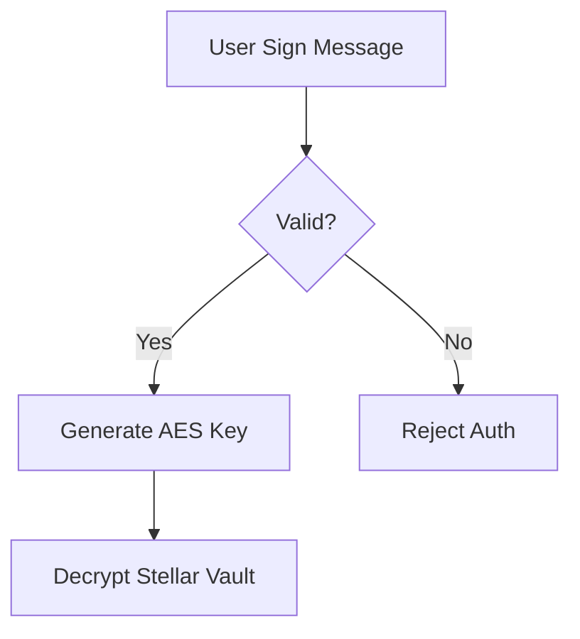

# 📚 StellarUpi GitBook Documentation Guide

Welcome to the comprehensive guide for maintaining and expanding the **StellarUpi (Stellar Pay)** technical documentation. This guide is designed for developers, contributors, and technical writers who want to build a world-class documentation site using GitBook.

---

## 🗺️ Documentation Map

The GitBook is structured into four primary pillars:
1.  **Onboarding & Core**: Fundamentals of the Stellar-UPI bridge.
2.  **Product Features**: Deep dives into Family Vaults, Groups, and AI.
3.  **Technical Architecture**: Cryptography, Smart Contracts, and APIs.
4.  **Compliance & Security**: Legal framework and transaction safety.

---

## 📂 GitBook Structure (Proposed)

To ensure a logical flow, follow this directory structure for your Markdown files:

```text
docs/
├── README.md               # Introduction / Welcome
├── getting-started/
│   ├── quick-start.md      # 5-minute setup
│   ├── architecture.md     # High-level system design
│   └── setup-env.md        # Environment variables guide
├── core-features/
│   ├── web3-auth.md        # Signature-based vault tech
│   ├── payments.md         # Path payments & QR logic
│   ├── family-vaults.md    # Spending limits & sub-accounts
│   └── shared-wallets.md   # Group splits & chat
├── ai-intelligence/
│   ├── raze-ai.md          # Gemini 1.5 Flash integration
│   └── identity-ocr.md     # On-device Tesseract logic
├── developers/
│   ├── stellar-integration.md # Horizon & SDK usage
│   ├── firebase-schema.md     # Firestore data models
│   └── api-reference.md       # Service method documentation
├── legal-compliance/
│   ├── india-regulations.md   # FIU-IND & PMLA guidelines
│   └── tax-tds.md             # 1% TDS & 30% Tax logic
└── SUMMARY.md              # GitBook Navigation Menu
```

---

## 🛠️ Step-by-Step Creation Guide

### 1. The Power of `SUMMARY.md`
GitBook uses `SUMMARY.md` to generate the sidebar. **This is the most critical file.**

**Example `SUMMARY.md`:**
```markdown
# Table of contents

* [🚀 Introduction](README.md)

## 🏁 Getting Started
* [Quick Start](getting-started/quick-start.md)
* [System Architecture](getting-started/architecture.md)

## 💡 Core Features
* [Web3 Authentication](core-features/web3-auth.md)
* [Payments & QR](core-features/payments.md)
* [Family Spend Limits](core-features/family-vaults.md)

... (and so on)
```

### 2. Technical Documentation Standards
When writing new pages, strictly follow these formats:

#### **A. Code Blocks**
Always specify the language for syntax highlighting.
```typescript
// Example: Sending a Stellar Payment
const txHash = await stellarService.sendPayment({
  secret: userSecret,
  destination: "recipient@stellar",
  amount: 10
});
```

#### **B. Callouts (GitBook Flavored)**
Use specific syntax for warnings or tips:
> 📘 **Tip:** Always use `sessionStorage` for the decrypted Stellar secret to ensure it's wiped on tab close.
> 
> 🚧 **Warning:** Never log the user's secret key to the console, even in development.

#### **C. Flowcharts (Mermaid.js)**
GitBook supports Mermaid. Use it for diagrams:


---

## 🔐 Documenting the Cryptography

One of the most complex parts of StellarUpi is the **Signature-Based Vault**. Ensure the documentation covers:
1.  **Entropy Generation**: How Ethers.js generates the message to sign.
2.  **PBKDF2 Derivation**: How the signature acts as a seed for the AES key.
3.  **Client-Side Execution**: Emphasize that decryption happens *only* in the browser runtime.

---

## ⚖️ Documenting Compliance (India 2026)

The GitBook must have a dedicated section for legal transparency:
*   **TDS Logic**: Explain the backend trigger for the 1% deduction on XLM -> INR events.
*   **PAN Hashing**: Document how identity is verified without storing raw PAN numbers (Salted SHA-256).

---

## 🚀 Deployment Guide

### Git-Sync vs. Manual Upload
1.  **Git-Sync (Recommended)**:
    *   Connect your GitHub repository to GitBook.com.
    *   Every time you push to the `main` branch, the documentation updates automatically.
    *   Enable "Two-way Sync" if you want to edit on the GitBook UI and have it commit back to your repo.

2.  **Configuration (`gitbook.yaml`)**:
    Add this to your root to customize the look:
    ```yaml
    theme:
      color: "#E5D5B3" # StellarPay Gold
    plugins:
      - search
      - mermaid
    ```

---

## 🌟 Best Practices for Hackathons
*   **Visuals**: Use `generate_image` or screenshots for every major page.
*   **Demo Links**: Ensure every page has a "Try it out" link pointing to the specific route in the live app.
*   **API Tables**: Use clear Markdown tables for function definitions.

---

<p align="center">
  <em>"Great code is invisible without great documentation."</em>
</p>
