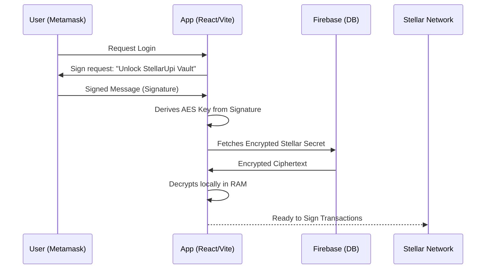

# 🏗️ System Architecture

StellarUpi is a hybrid Web3 application that combines the security of self-custody with the ease of use of a centralized app.

## 🌉 The Hybrid Model

Our architecture rests on three layers:

### 1. Identity & Auth (Ethereum/EVM)
We use Ethereum wallets (Metamask, etc.) as the primary identity layer. Users don't need to remember a new seed phrase; they just use their existing Web3 identity to "unlock" their Stellar workspace.

### 2. Settlement Layer (Stellar)
All financial transactions happen on Stellar. 
*   **Asset Support**: XLM (Native), USDC (Circle), and custom anchors for INR.
*   **Protocol**: SEP-7 (Handheld QR), SEP-10 (Auth), and Claimable Balances.

### 3. Metadata Layer (Firebase)
We use Firebase for real-time features that aren't practical on-chain:
*   Real-time chat in groups.
*   Encrypted Stellar vault storage.
*   Identity Registry (mapping names to public keys).

## 🔐 The Security Flow (Signature-to-Vault)

This is the core of our "Custodial-experience with Self-custody" security:

## 📂 Project Structure

*   `src/components`: Reusable UI elements (QR Scanners, AI Interface, Sonic pairing).
*   `src/services`: Core logic for Stellar (Horizon), AI (Gemini), and Database (Firebase).
*   `src/context`: Global state for Authentication, Network settings, and Notifications.
*   `src/pages`: Feature-specific views (Gullak, Family Manager, Shared Wallet).

## 📡 External Integrations

*   **Gemini 1.5 Flash**: Powers Raze AI for financial NLP.
*   **GGWave**: Facilitates Sonic Transfer via ultrasonic data packets.
*   **Onramp.money**: Fiat-to-Crypto gateway for the Indian market.
*   **Tesseract.js**: On-device OCR for private ID verification.
