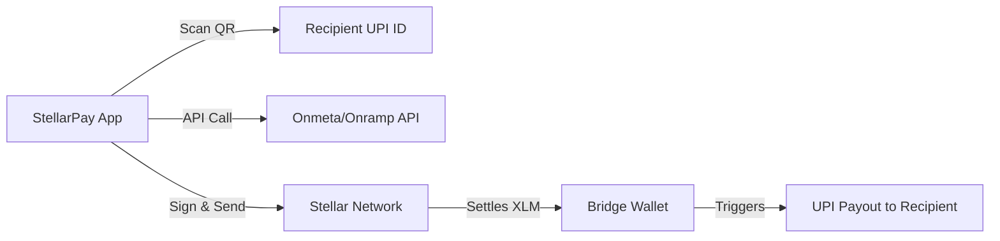

# Direct Off-Ramping Guide - StellarPay UPI

## 1. The Goal: "Real" Off-Ramping
To compete with traditional UPI apps, StellarPay needs more than just a widget. It needs a "Direct to VPA" flow where a user can scan a merchant or friend's UPI QR and pay using their XLM balance instantly.

---

## 2. Implementation Strategy: Two Approaches

### High-Friction (Current): SDK Widgets
- **Providers**: Onramp.money, Transak.
- **Flow**: User opens a modal -> Enters bank details -> Sends XLM manually -> Waits.
- **Status**: Already implemented. Best for bulk withdrawals to self.

### Low-Friction (The Goal): API-Driven Payouts
- **Providers**: Onmeta, Onramp.money (Enterprise API), Alchemy Pay.
- **Flow**: User scans UPI QR -> App calculates XLM cost -> User confirms -> App triggers an automated API call -> Recipient receives INR in seconds.
- **Status**: Planned for v2.0.

---

## 3. Step-by-Step Logic for "Direct to UPI"

### Step 1: Scan & Resolve
Capture the recipient's **Virtual Payment Address (VPA)** (e.g., `merchant@hdfc`) and the required **INR amount** from a standard UPI QR code.

### Step 2: Path Finding & Rate Lock
Query your price oracle (CoinGecko or the provider's API) to determine the exact XLM/USDC amount needed. Add a small buffer (0.5% - 1%) for volatility.

### Step 3: Payout Initiation (Backend)
Call your bridge provider's API (e.g., Onmeta) to create a "Sell Order":
- **Source**: XLM (on Stellar).
- **Destination**: The target VPA (`merchant@hdfc`).
- **Amount**: The exact INR amount requested by the merchant.

### Step 4: Stellar Settlement
The app signs a transaction sending XLM to the provider's **Bridge Wallet**. Once the Stellar transaction is confirmed (~5 seconds), the provider's webhook triggers the **UPI Payout**.

### Step 5: Verification
Listen for a "Payout Success" webhook from the provider. Display a premium success screen to the user.

---

## 4. Recommended Resources & SDKs

### A. Dedicated On/Off-Ramp APIs
| Provider | Why use them? | Resource |
| :--- | :--- | :--- |
| **Onmeta** | India-specific, supports UPI direct payouts, handles compliance/TDS. | [Onmeta Docs](https://docs.onmeta.in/) |
| **Onramp.money** | Localized for India, high success rates for UPI. | [Onramp.money API](https://onramp.money/main/partner) |
| **Alchemy Pay** | Global reach with excellent India support. | [Alchemy Pay SDK](https://alchemypay.org/) |

### B. Fiat Payout Infrastructure (B2B)
If you operate your own liquidity or treasury, use these to trigger the actual bank transfer:
- **Decentro**: Best for UPI Payouts and Virtual Accounts.
- **Cashfree / RazorpayX**: Standard industry APIs for instant INR disbursements via IMPS/UPI.

---

## 5. Technical Architecture (My App to Any UPI)

### App-to-App vs. App-to-UPI
- **App-to-App**: Pure Stellar transaction. Instant, free, uses human handles (e.g., `bob@stellar`).
- **App-to-UPI**: A "Crypto-to-Fiat" bridge transaction. Involves a provider, takes 1-5 minutes, incurs minor fees (~1-2%).

---

## 6. Implementation Checklist & Suggestions
1. **KYC Tiers**: Start with a "Sandbox" mode. For real money, integrate a lightweight KYC provider (Aadhaar/OTP) as required by Indian law.
2. **TDS Management**: Since July 2022, a 1% TDS is mandatory on crypto sales in India. Using a partner like **Onmeta** is highly recommended because they handle the TDS deduction and filing automatically.
3. **Soroban Integration**: Use Stellar's Soroban smart contracts to create a "Hold/Escrow" mechanism so funds are only released to the bridge once a pulse/handshake is verified.
4. **Merchant Integration**: Create a "StellarPay for Business" QR that merchants can display, which allows users to choose between XLM (free) or UPI (bridged) payments.
